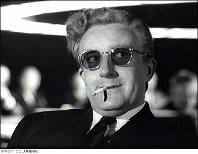

# In the morning

## Getting up

- Turn off alarm
- Get out of bed

## Breakfast

- Eat eggs
- Drink coffee

# In the evening

## Dinner

- Eat spaghetti
- Drink wine

## Image

This is **Dr. Strangelove**.

{ width=50% }

## Going to sleep

- Get in bed
- Count sheep

# Markup

## Python

Sample Python code with syntax highlighting.

```python
import sys
import re

print(sys.argv[0])
if len(sys.argv) > 3:
    print("Ok!")
```

## Maths {#maths}

* Bayes theorem: $P(H|E) = \frac{P(E|H) P(H)}{P(E)}$
* $\sqrt{x^2-1}$ is a random formula.

## Tables

Markdown table:

| **Right** | Left | Default | Center |
|------:|:-----|---------|:------:|
|   12  |  12  |    12   |    12  |
|  123  |  123 |   123   |   123  |
|    1  |    1 |     1   |     1  |

  : Demonstration of pipe table syntax.

\begin{table}[h]
\begin{center}
\begin{tabular}{|l|l|}\hline
Age & Frequency \\ \hline
18--25  & 15 \\
26--35  & 33 \\
36--45  & 22 \\ \hline
\end{tabular}
\caption{Pure {\LaTeX} table}
\end{center}
\end{table}

## Links

* **Internal link**: link to [markup](#markup).
* **External link**: link to [Google](https://google.com).
